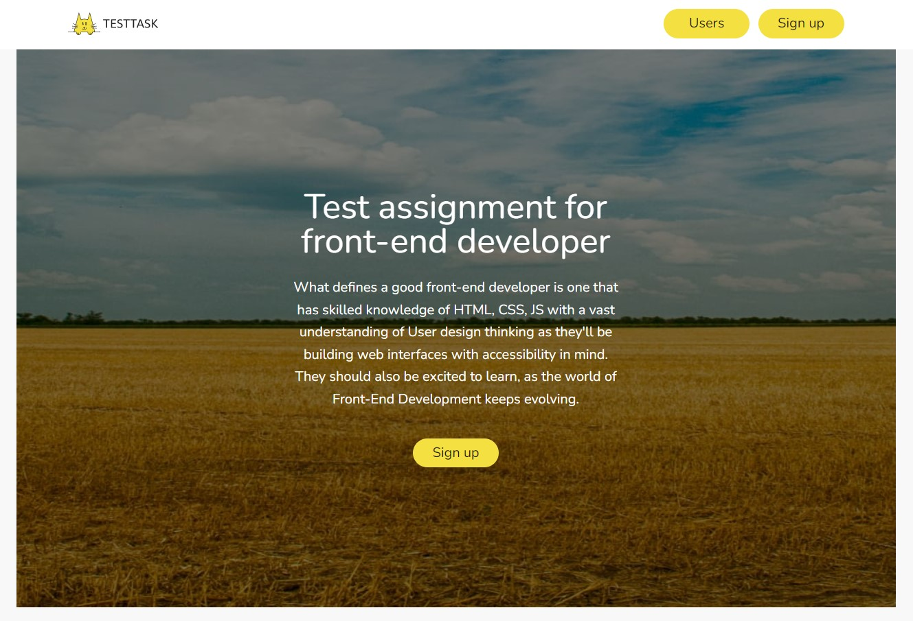
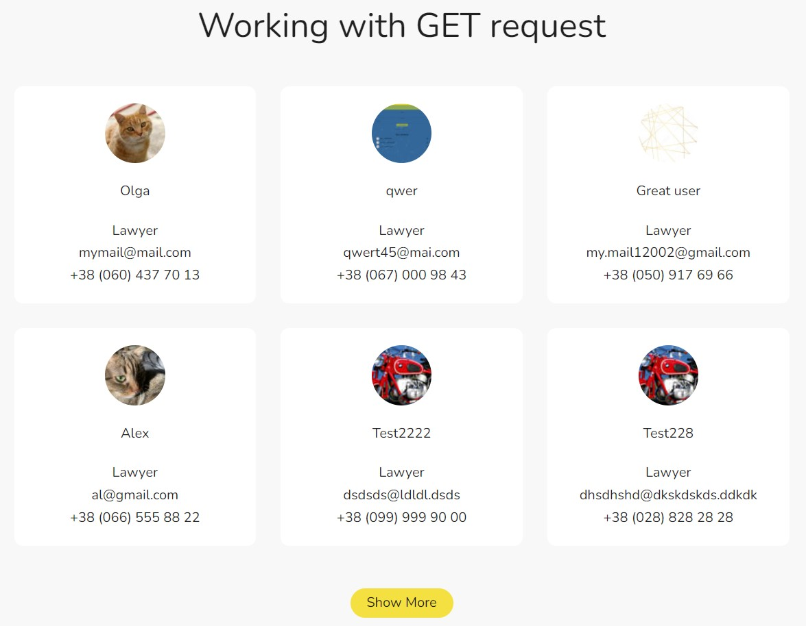
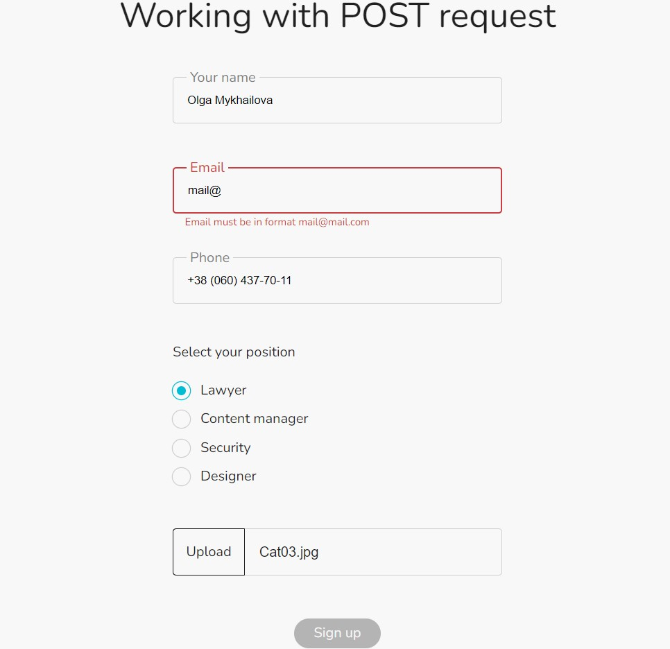
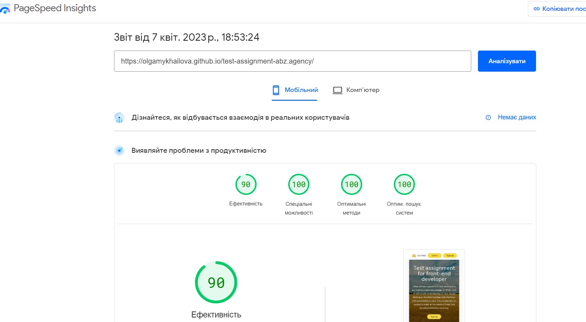
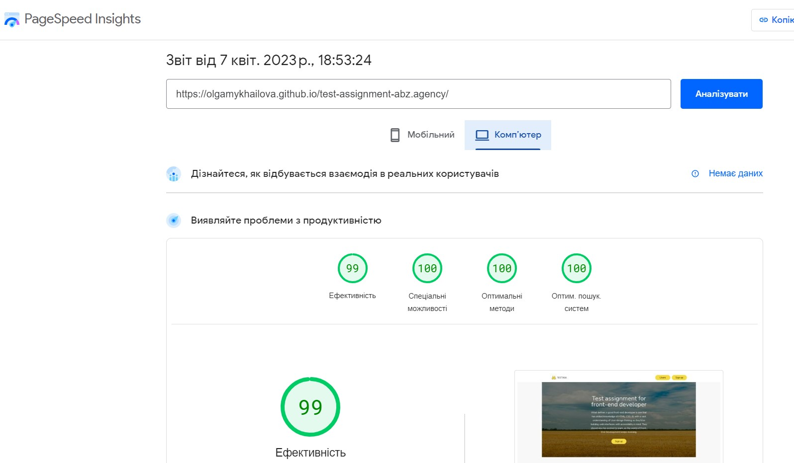

# Test Assignment for abz.agency

## Technical Features

This App is made with React. For working with REST API is used Axios, to create signup form is used Formik with validation by Yup, React-text-mask is used to create masked input for the phone number field, for notification is used React-toastify, styles are made with Sass  preprocessor. Responsive/Adaptive design (four breakpoints: 360px, 768px, 1024px, 2560px)

## Description

This is a Test Assignment for abz.agency. It is one-page application that consists from four sections: header, hero, working with GET request section and working with POST request section.

Header has a navigation menu that allows you to navigate to the required section. Hero section also has Sign up button, that navigates to Sign up form.

In the working with GET request section you can see list of users (six users by default). You can additionally download user cards by clicking Load more button. If the end of the list is reached, the Load more button will not be displayed. If the name or email is too long, the text in the card will be truncated. The full text can be seen in the tooltip that appears when hovering over the hidden text. Implemented a check where the tooltip is displayed only when part of the text has been hidden. 

In the working with POST request section you can see Sign up form. In the form is implemented validation of all fields, they are all required and meet the requirements specified in the technical task. An input mask is made for the phone number input field, so filling this field is very convenient for the user and does not require an additional prompt from the bottom of the field. The file upload field is checked for file type, file size, and dimensions of the image. The Sign up button is disabled until all fields are validated. After successfully sending the form, the user will receive a message about successful registration

Images are optimized for retina screens.

Header and Hero Section




Working with GET request section



Working with POST request section



PageSpeed Insights:

Mobile



Desktop



## Deploy

[Link](https://olgamykhailova.github.io/test-assignment-abz.agency/)

## Project setup

```
npm install
npm start
```